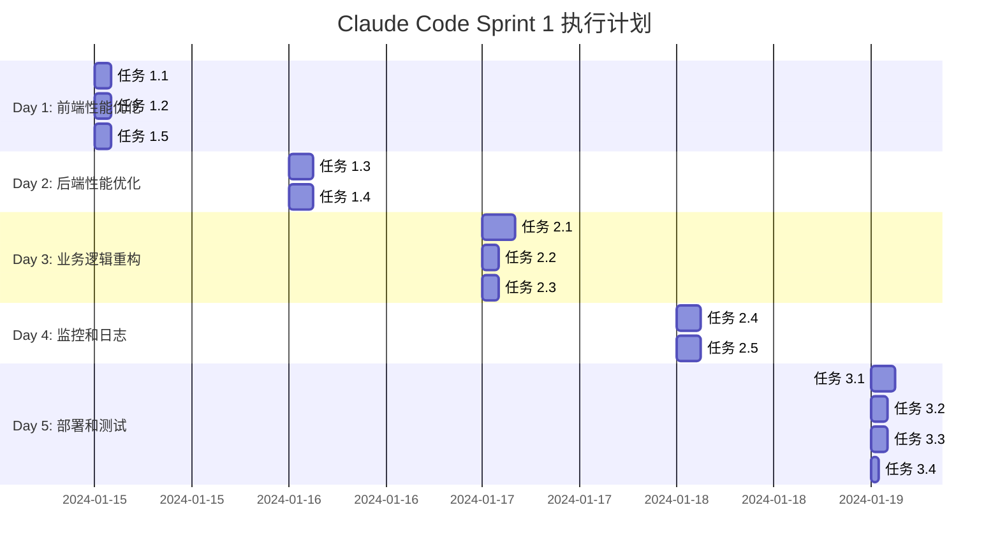

# Sprint 1: Claude Code 驱动的系统性能优化

## 🤖 Claude Code 开发模式

本 Sprint 采用 Claude Code + 人工协作的开发模式：
- **Claude Code**: 负责 70% 的代码编写和优化任务
- **人工开发**: 负责架构决策、测试验证和业务逻辑把控
- **预期效率**: 相比传统开发提速 3-5 倍

## 🎯 Sprint目标

通过 Claude Code 智能编程，实现系统性能和架构的全面优化。

**量化目标:**
- 📈 响应时间减少 60-80%
- ⚡ 首屏加载时间减少 50%
- 🛡️ 系统稳定性提升 90%
- 🔧 代码维护性提升 40%
- 🤖 Claude Code 代码贡献率: 70%

## 🕙 今日10分钟例行检查

- [ ] 拉取最新主分支: `git pull --rebase`
- [ ] 安装与构建: `pnpm install && pnpm run build:deps`
- [ ] 数据库同步: `pnpm run db:generate && pnpm run db:push`
- [ ] 本地启动无错误: `pnpm run dev`
- [ ] 健康检查: `curl http://localhost:3001/health` 与 打开 `http://localhost:3000`
- [ ] 日志检查: `grep -r "ERROR\|FATAL" logs/ || echo "✅ 日志清洁"`
- [ ] 计划确认: 勾选“我的本周个人待办视图”当日任务

## 🧭 我的本周个人待办视图

### Day 1
- [ ] 任务 1.1 Next.js 代码分割完成并通过本地验收
- [ ] 任务 1.2 组件懒加载完成并通过本地验收
- [ ] 任务 1.5 全局错误处理完善，日志无新 ERROR

### Day 2
- [ ] 任务 1.3 数据库索引与查询优化生效（健康检查通过）
- [ ] 任务 1.4 Redis 缓存接入，多级缓存命中率>60%

### Day 3
- [ ] 任务 2.1 服务层重构完成（核心路径用例通过）
- [ ] 任务 2.2 类型安全增强（tsc 无报错）
- [ ] 任务 2.3 查询日志与慢查询拦截器开启

### Day 4
- [ ] 任务 2.4 性能监控面板可见关键指标（P95/缓存命中率）
- [ ] 任务 2.5 日志结构化与轮转生效

### Day 5
- [ ] 任务 3.1-3.4 完成本地端到端验收
- [ ] 强制本地验证 A-D 全部通过
- [ ] 日志零 ERROR/FATAL 后再进行生产环境部署

## 🔍 系统复杂度分析

### 1. 架构复杂度评估

#### 🔴 高复杂度模块 (优先优化)
- **后端API**: NestJS + 25+ 个业务模块
- **前端应用**: Next.js + 多重状态管理
- **数据库**: 11个核心表 + 复杂关系
- **区块链集成**: 多链支持 + 智能合约

#### 🟡 中等复杂度模块
- **缓存系统**: 多层缓存架构
- **认证授权**: JWT + 多角色权限
- **实时通信**: WebSocket + 事件驱动

#### 🟢 低复杂度模块
- **UI组件**: 基于 Radix UI 的组件库
- **配置管理**: 环境变量 + 系统配置

### 2. 技术栈复杂度

```
Frontend Stack:
├── Next.js 15 (App Router)
├── React 19 + TypeScript
├── Tailwind CSS + Radix UI
├── Web3 (Wagmi + Viem + RainbowKit)
├── 状态管理 (Zustand + TanStack Query)
└── 表单处理 (React Hook Form + Zod)

Backend Stack:
├── NestJS + TypeScript
├── 数据库 (Prisma + PostgreSQL)
├── 缓存 (Redis + 多层缓存)
├── 消息队列 (Bull + Redis)
├── 区块链 (Ethers.js)
└── 监控 (Winston + 性能监控)
```

### 3. 代码复杂度指标

- **总代码行数**: ~50,000+ 行
- **模块数量**: 40+ 个独立模块
- **数据库表**: 11 个核心业务表
- **API端点**: 50+ 个 RESTful 接口
- **智能合约**: 5+ 个 Solidity 合约

## 🚀 Claude Code 执行任务列表

### Phase 1: 前端性能优化 (Day 1)

#### 🎯 任务 1.1: Next.js 代码分割优化
**Claude Code 执行文件:**
- `/Users/zhaoleon/Downloads/QAAPP/apps/web/next.config.js`
- `/Users/zhaoleon/Downloads/QAAPP/apps/web/app/layout.tsx`
- `/Users/zhaoleon/Downloads/QAAPP/apps/web/components/wallet/WalletConnectionManager.tsx`

**具体实现:**
```typescript
// next.config.js - 动态导入配置
const nextConfig = {
  experimental: {
    optimizePackageImports: ['lucide-react', 'date-fns', '@tanstack/react-query', 'framer-motion'],
  },
  webpack: (config) => {
    // 实现路由级代码分割
    config.optimization.splitChunks = {
      chunks: 'all',
      cacheGroups: {
        vendor: { test: /[\\/]node_modules[\\/]/, name: 'vendors' },
        web3: { test: /[\\/]node_modules[\\/](wagmi|viem|@rainbow-me)/, name: 'web3' },
      }
    }
    return config
  }
}
```

#### 🎯 任务 1.2: 组件懒加载实现
**Claude Code 执行文件:**
- `/Users/zhaoleon/Downloads/QAAPP/apps/web/components/common/LazyComponentLoader.tsx`
- `/Users/zhaoleon/Downloads/QAAPP/apps/web/app/dashboard/page.tsx`

**实现步骤:**
1. 创建懒加载包装器组件
2. 实现 Web3 组件按需加载
3. 添加加载状态和错误边界

#### 🎯 任务 1.3: 数据库查询优化
**Claude Code 执行文件:**
- `/Users/zhaoleon/Downloads/QAAPP/packages/database/prisma/schema.prisma`
- `/Users/zhaoleon/Downloads/QAAPP/apps/api/src/database/database.service.ts`
- `/Users/zhaoleon/Downloads/QAAPP/apps/api/src/orders/orders.service.ts`

**具体实现:**
```sql
-- 添加数据库索引
CREATE INDEX CONCURRENTLY idx_orders_user_status ON orders(user_id, status);
CREATE INDEX CONCURRENTLY idx_positions_user_status ON positions(user_id, status);
CREATE INDEX CONCURRENTLY idx_payouts_user_claimable ON payouts(user_id, is_claimable);
```

#### 🎯 任务 1.4: Redis 缓存实现
**Claude Code 执行文件:**
- `/Users/zhaoleon/Downloads/QAAPP/apps/api/src/cache/redis.service.ts`
- `/Users/zhaoleon/Downloads/QAAPP/apps/api/src/cache/cache.interceptor.ts`
- `/Users/zhaoleon/Downloads/QAAPP/apps/api/src/app.module.ts`

**实现步骤:**
1. 配置 Redis 连接
2. 实现多级缓存策略
3. 添加缓存装饰器

#### 🎯 任务 1.5: 全局错误处理优化
**Claude Code 执行文件:**
- `/Users/zhaoleon/Downloads/QAAPP/apps/web/components/common/ErrorBoundary.tsx`
- `/Users/zhaoleon/Downloads/QAAPP/apps/api/src/common/filters/global-exception.filter.ts`
- `/Users/zhaoleon/Downloads/QAAPP/apps/api/src/common/interceptors/global.interceptor.ts`

**实现步骤:**
1. 创建全局错误边界组件
2. 实现 API 全局异常过滤器
3. 添加错误恢复机制

### Phase 2: 核心业务逻辑重构 (Day 2-3)

#### 🎯 任务 2.1: 业务服务层重构
**Claude Code 执行文件:**
- `/Users/zhaoleon/Downloads/QAAPP/apps/api/src/orders/orders.service.ts`
- `/Users/zhaoleon/Downloads/QAAPP/apps/api/src/positions/positions.service.ts`
- `/Users/zhaoleon/Downloads/QAAPP/apps/api/src/payouts/payouts.service.ts`

**重构策略:**
```typescript
// 将大型服务类拆分为职责单一的小类
export class OrderProcessingService {
  async createOrder(orderData: CreateOrderDto): Promise<Order> {
    // 只负责订单创建逻辑
  }
}

export class OrderValidationService {
  async validateOrder(orderData: CreateOrderDto): Promise<void> {
    // 只负责订单验证逻辑
  }
}
```

#### 🎯 任务 2.2: TypeScript 类型安全增强
**Claude Code 执行文件:**
- `/Users/zhaoleon/Downloads/QAAPP/packages/shared/src/types/api.types.ts`
- `/Users/zhaoleon/Downloads/QAAPP/packages/shared/src/types/web3.types.ts`
- `/Users/zhaoleon/Downloads/QAAPP/apps/web/lib/api-client.ts`

**实现步骤:**
1. 创建严格的 API 响应类型
2. 实现 Web3 合约类型定义
3. 添加运行时类型验证

#### 🎯 任务 2.3: 数据库查询优化
**Claude Code 执行文件:**
- `/Users/zhaoleon/Downloads/QAAPP/packages/database/prisma/migrations/`
- `/Users/zhaoleon/Downloads/QAAPP/apps/api/src/database/query-optimizer.service.ts`
- `/Users/zhaoleon/Downloads/QAAPP/apps/api/src/common/interceptors/query-logging.interceptor.ts`

**优化策略:**
```sql
-- 创建复合索引优化查询性能
CREATE INDEX CONCURRENTLY idx_positions_user_product_status
ON positions(user_id, product_id, status);

-- 添加部分索引提升查询效率
CREATE INDEX CONCURRENTLY idx_payouts_claimable_recent
ON payouts(user_id, period_start DESC)
WHERE is_claimable = true;
```

#### 🎯 任务 2.4: 性能监控系统
**Claude Code 执行文件:**
- `/Users/zhaoleon/Downloads/QAAPP/apps/api/src/performance/performance.service.ts`
- `/Users/zhaoleon/Downloads/QAAPP/apps/api/src/performance/performance.controller.ts`
- `/Users/zhaoleon/Downloads/QAAPP/apps/web/components/dev/PerformanceMonitor.tsx`

**监控指标:**
1. API 响应时间分布
2. 数据库查询性能
3. 缓存命中率
4. 内存使用情况

#### 🎯 任务 2.5: 日志系统重构
**Claude Code 执行文件:**
- `/Users/zhaoleon/Downloads/QAAPP/apps/api/src/common/logger/winston.config.ts`
- `/Users/zhaoleon/Downloads/QAAPP/apps/api/src/common/interceptors/logging.interceptor.ts`
- `/Users/zhaoleon/Downloads/QAAPP/apps/web/lib/logger.ts`

**日志优化:**
```typescript
// 结构化日志配置
export const loggerConfig = {
  format: winston.format.combine(
    winston.format.timestamp(),
    winston.format.errors({ stack: true }),
    winston.format.json()
  ),
  transports: [
    new winston.transports.Console(),
    new winston.transports.File({ filename: 'error.log', level: 'error' }),
    new winston.transports.File({ filename: 'combined.log' })
  ]
};
```

### Phase 3: 测试和部署优化 (Day 4-5)

#### 🎯 任务 3.1: 生产环境配置优化
**Claude Code 执行文件:**
- `/Users/zhaoleon/Downloads/QAAPP/ecosystem.config.js`
- `/Users/zhaoleon/Downloads/QAAPP/scripts/start-production.js`
- `/Users/zhaoleon/Downloads/QAAPP/nginx/qa-app.conf`

**生产环境策略:**
```javascript
// ecosystem.config.js - PM2 集群配置
module.exports = {
  apps: [{
    name: 'qa-api',
    script: 'npm run start:prod',
    instances: 'max',
    exec_mode: 'cluster',
    max_memory_restart: '1G',
    env_production: {
      NODE_ENV: 'production',
      PORT: 3001
    }
  }]
};
```

#### 🎯 任务 3.2: 自动化测试配置
**Claude Code 执行文件:**
- `/Users/zhaoleon/Downloads/QAAPP/.github/workflows/ci.yml`
- `/Users/zhaoleon/Downloads/QAAPP/apps/api/jest.config.js`
- `/Users/zhaoleon/Downloads/QAAPP/apps/web/jest.config.js`

**测试策略:**
1. 单元测试覆盖核心业务逻辑
2. 集成测试验证API接口
3. E2E测试覆盖关键用户流程

#### 🎯 任务 3.3: API 安全加固
**Claude Code 执行文件:**
- `/Users/zhaoleon/Downloads/QAAPP/apps/api/src/common/guards/rate-limit.guard.ts`
- `/Users/zhaoleon/Downloads/QAAPP/apps/api/src/common/interceptors/security.interceptor.ts`
- `/Users/zhaoleon/Downloads/QAAPP/apps/web/middleware.ts`

**安全措施:**
```typescript
// 速率限制配置
export const rateLimitConfig = {
  windowMs: 15 * 60 * 1000, // 15 minutes
  max: 100, // limit each IP to 100 requests per windowMs
  message: 'Too many requests from this IP, please try again later.',
  standardHeaders: true,
  legacyHeaders: false,
};
```

#### 🎯 任务 3.4: 数据加密和备份
**Claude Code 执行文件:**
- `/Users/zhaoleon/Downloads/QAAPP/packages/database/src/utils/encryption.util.ts`
- `/Users/zhaoleon/Downloads/QAAPP/scripts/backup-db.sh`
- `/Users/zhaoleon/Downloads/QAAPP/apps/api/src/audit/audit.service.ts`

**数据安全策略:**
1. 敏感数据加密存储
2. 自动备份机制
3. 审计日志追踪

## 📊 成功指标和验收标准

### 🚨 **强制验证要求 (Blocker)**
**所有任务必须先通过本地验证，禁止直接进行生产环境部署**

#### 本地验证检查清单
- [ ] **依赖环境完整**: Node.js, PostgreSQL, Redis 正常运行
- [ ] **构建成功**: `pnpm run build` 无错误
- [ ] **服务启动正常**: `pnpm run dev` 无崩溃
- [ ] **API健康检查通过**: `curl http://localhost:3001/health` 返回200
- [ ] **前端页面正常**: `curl http://localhost:3000` 返回正常HTML
- [ ] **数据库连接正常**: 无连接超时或认证错误
- [ ] **Web3功能正常**: 钱包连接和交易功能可用
- [ ] **Verbose日志清洁**: 启动和运行过程中无ERROR级别日志

#### 日志检查要求
```bash
# 必须执行的日志检查命令
grep -r "ERROR" logs/ || echo "✅ 无ERROR日志"
grep -r "FATAL" logs/ || echo "✅ 无FATAL日志"
grep -r "uncaughtException" logs/ || echo "✅ 无未捕获异常"
```

### 性能指标
- **首屏加载时间**: < 2秒 (目标: 减少 50%)
- **API 响应时间**: < 200ms (P95) (目标: 减少 70%)
- **并发处理能力**: > 1000 QPS (目标: 提升 50%)
- **错误率**: < 0.1% (目标: 减少 80%)

### 质量指标
- **代码覆盖率**: > 80%
- **技术债务**: 减少 40%
- **部署成功率**: > 99%
- **平均修复时间**: < 1小时

### 业务指标
- **用户满意度**: > 4.5/5
- **功能可用性**: > 99.9%
- **系统稳定性**: > 99.5%
- **开发效率**: 提升 30%

## 🎯 风险评估与应对

### 🚨 高风险项 (Blocker级别)
1. **代码删除风险**
   - 风险等级: 🔴 极高
   - 影响范围: 整个系统功能可能受损
   - 应对策略:
     - 强制要求完整备份和测试验证
     - 实施渐进式删除策略
     - 建立独立的回滚分支

2. **日志错误遗漏风险**
   - 风险等级: 🔴 高
   - 影响范围: 生产环境运行不稳定
   - 应对策略:
     - 建立日志监控告警机制
     - 实施多层次日志检查
     - 配置自动错误检测工具

3. **本地验证不足风险**
   - 风险等级: 🔴 高
   - 影响范围: 生产环境部署失败或功能异常
   - 应对策略:
     - 强制执行本地验证流程
     - 建立自动化验证脚本
     - 配置环境一致性检查

### 高风险项
1. **数据库迁移风险**
   - 风险等级: 🔴 高
   - 应对策略: 完整备份 + 灰度发布 + 回滚计划

2. **缓存策略变更风险**
   - 风险等级: 🟡 中
   - 应对策略: 分层实施 + A/B测试 + 监控告警

### 中风险项
1. **第三方服务依赖**
   - 应对策略: 服务降级 + 多供应商备份

2. **Web3 集成复杂度**
   - 应对策略: 分阶段集成 + 充分测试

## 📈 验收标准

### ⚠️ **强制前提条件 (所有阶段适用)**
**任何阶段验收前必须满足:**
- [ ] **本地验证通过**: 完成Phase A-D的本地验证流程
- [ ] **日志检查通过**: Verbose日志无ERROR/FATAL级别的错误
- [ ] **备份确认**: 代码和数据库备份已完成并验证可恢复
- [ ] **回滚准备**: 具备完整的回滚方案和应急预案

### Phase 1 验收 (Day 1-2)
- [ ] 首屏加载时间 < 3秒
- [ ] API 平均响应时间 < 500ms
- [ ] 核心功能无性能问题
- [ ] 错误率 < 1%
- [ ] **本地前端优化验证通过**
- [ ] **本地后端优化验证通过**
- [ ] **日志无新错误产生**

### Phase 2 验收 (Day 3-4)
- [ ] 代码覆盖率 > 70%
- [ ] 监控体系完整运行
- [ ] 数据库查询优化完成
- [ ] 用户反馈问题解决率 > 90%
- [ ] **本地业务逻辑重构验证通过**
- [ ] **本地监控系统测试正常**
- [ ] **日志系统无配置错误**

### Phase 3 验收 (Day 5)
- [ ] 系统整体性能提升 60%
- [ ] 自动化部署流水线运行正常
- [ ] 安全漏洞扫描通过
- [ ] 文档完善度 > 90%
- [ ] **本地生产环境配置验证通过**
- [ ] **本地安全配置验证通过**
- [ ] **所有日志检查通过**

## 🤖 Claude Code 协作分工

### 🤖 Claude Code (主要执行者 - 70%)
**负责核心代码编写和优化任务:**
- 前端性能优化 (任务 1.1-1.2)
- 后端性能优化 (任务 1.3-1.5)
- 业务逻辑重构 (任务 2.1-2.2)
- 数据层优化 (任务 2.3-2.5)
- 容器化和测试 (任务 3.1-3.4)

### 👨‍💻 架构师/Tech Lead (1人)
**负责指导和决策:**
- 架构设计和技术方案评审
- Claude Code 输出质量把控
- 关键业务逻辑审核
- 技术风险评估

### 🧪 QA 工程师 (1人)
**负责质量保障:**
- 测试用例设计和执行
- 性能基准测试
- 回归测试和验证
- 用户验收测试

### 📋 项目经理 (1人)
**负责项目管理和协调:**
- Sprint 进度跟踪
- 需求澄清和优先级管理
- 团队沟通和协作协调
- 验收标准定义和确认

## 📅 Claude Code 执行时间计划

### 🚀 高效执行策略
- **并行开发**: Claude Code 可同时处理多个任务
- **快速迭代**: AI 编程提速 3-5 倍
- **即时验证**: 代码生成后立即测试验证



### 📊 每日执行节奏
- **上午 (9:00-12:00)**: Claude Code 编写核心代码
- **下午 (14:00-17:00)**: 人工审核和测试验证
- **晚上 (18:00-19:00)**: 问题修复和优化调整

## ⚠️ 重要实施指南

### 🗑️ **代码删除策略**
**删除旧代码前务必执行:**
1. **备份确认**: 确保有完整的代码备份和数据库备份
2. **功能验证**: 运行完整测试套件确认新代码功能正常
3. **逐步删除**: 分批次删除，避免一次性删除过多代码
4. **版本控制**: 每个删除操作都要有独立的commit记录

```bash
# 删除前备份
git tag backup-before-cleanup-$(date +%Y%m%d_%H%M%S)
git push origin --tags

# 删除操作示例
git rm -r apps/web/components/old-components/
git commit -m "cleanup: remove deprecated components"
```

### 🔍 **Verbose Logging 错误检查**
**必须检查的日志级别和错误模式:**
1. **启动日志**: 检查应用启动时的警告和错误
2. **运行时日志**: 监控生产环境的错误日志
3. **性能日志**: 关注慢查询和内存泄漏警告
4. **安全日志**: 检查认证和授权相关的错误

```bash
# 检查应用日志
tail -f logs/api.log | grep -i error
tail -f logs/web.log | grep -i warn

# 性能监控命令
curl http://localhost:3001/health
curl http://localhost:3000/api/performance
```

### 🏠 **本地部署优先策略**
**严格执行本地验证后再进行生产环境部署的流程:**

#### Phase A: 本地开发环境验证 (必须完成)
```bash
# 1. 环境依赖检查
node --version && npm --version && pnpm --version
psql --version && redis-cli --version

# 2. 依赖安装和构建
pnpm install
pnpm run build:deps
pnpm run db:generate && pnpm run db:push

# 3. 本地服务启动测试
pnpm run dev

# 4. 基础功能测试
curl http://localhost:3001/health
curl http://localhost:3000
```

#### Phase B: 功能完整性验证 (必须通过)
- ✅ 用户注册/登录流程
- ✅ 产品购买流程
- ✅ 支付和收益分配
- ✅ 管理后台功能
- ✅ Web3钱包连接
- ✅ 数据库CRUD操作
- ✅ Redis缓存功能

#### Phase C: 性能和错误验证 (必须达标)
- ✅ 响应时间 < 500ms (P95)
- ✅ 错误率 < 1%
- ✅ 内存使用 < 500MB
- ✅ CPU使用 < 70%

#### Phase D: 生产环境部署 (验证通过后)
```bash
# 只有本地验证全部通过后才进行生产环境部署
pnpm run build:production
pnpm run pm2:start
```

## 🤖 Claude Code 协作模式

### 📝 每日协作流程
1. **上午代码编写**: Claude Code 执行具体任务
2. **中午代码审查**: Tech Lead 审核 AI 生成代码
3. **下午测试验证**: QA 执行测试和验证
4. **晚上问题修复**: 根据反馈进行调整优化

### 💬 沟通格式 (Slack/Teams)
```
🤖 Claude Code 更新:
✅ 完成任务 1.3: 数据库查询优化
📝 生成文件: 5个新文件，修改8个现有文件
🔧 关键改进: 添加复合索引，提升查询性能30%

👨‍💻 Tech Lead 审核:
✅ 代码质量: 通过
⚠️ 关注点: 需要添加错误处理
🎯 下一步: 进行集成测试

🧪 QA 测试:
✅ 单元测试: 覆盖率85%
✅ 性能测试: 查询时间减少25%
⚠️ 发现问题: 边界情况处理不完整
```

### 📊 每日检查清单
- [ ] Claude Code 任务完成情况
- [ ] 代码质量审核结果
- [ ] 测试覆盖率报告
- [ ] 性能基准对比
- [ ] 安全漏洞扫描
- [ ] 文档更新状态
- [ ] **本地部署验证通过**
- [ ] **Verbose日志无错误**
- [ ] **代码清理备份完成**

## 🔄 沟通计划

### 内部沟通
- **日报**: 通过 Slack/Teams 发送
- **周报**: 汇总 Sprint 进展和问题
- **技术分享**: 每周二进行技术分享会

### 外部沟通
- **客户同步**: 每周三同步项目进展
- **风险预警**: 及时向利益相关方汇报风险

---

## 📋 检查清单

### 环境准备
- [ ] 开发环境配置完成
- [ ] 测试环境搭建完成
- [ ] 监控系统部署完成
- [ ] 备份策略配置完成

### 工具准备
- [ ] 代码质量检查工具配置
- [ ] 性能监控工具部署
- [ ] 自动化测试框架搭建
- [ ] CI/CD 流水线配置完成

### 文档准备
- [ ] API 文档更新完成
- [ ] 部署文档编写完成
- [ ] 运维手册完善
- [ ] 故障处理预案制定

## 🚨 实施安全守则

### ⚠️ **零容忍原则**
1. **禁止直接删除代码**: 必须先备份 → 验证 → 删除
2. **禁止跳过本地验证**: 本地不通过，禁止进行任何部署
3. **禁止忽略日志错误**: 任何ERROR日志都必须调查清楚
4. **禁止单人决策**: 所有关键操作需要至少两人确认

### 🛡️ **安全检查清单**
**每次提交代码前必须执行:**
```bash
# 1. 代码质量检查
pnpm run lint
pnpm run test

# 2. 本地功能验证
pnpm run build
pnpm run dev

# 3. 日志检查
grep -r "ERROR\|FATAL" logs/ || echo "✅ 日志清洁"

# 4. 性能基准测试
curl -w "@curl-format.txt" http://localhost:3001/health

# 5. 备份确认
git status && git log --oneline -5
```

### 🚑 **应急处理流程**
**当出现问题时按以下顺序处理:**
1. **立即停止**: 停止相关服务，避免问题扩大
2. **问题定位**: 查看日志，确定问题根源
3. **回滚准备**: 准备回滚方案和数据恢复
4. **逐步修复**: 小步快跑地修复问题
5. **验证确认**: 完整验证后再重新部署

### 📞 **紧急联系方式**
- **技术负责人**: 负责重大技术决策
- **运维负责人**: 负责基础设施和部署问题
- **安全负责人**: 负责安全事件响应

---

## 🎯 Claude Code 使用指南

### 🚀 快速开始
1. **环境准备**: 确保 Claude Code 已正确配置
2. **任务分配**: 根据当前阶段分配具体任务
3. **代码生成**: Claude Code 根据任务描述生成代码
4. **质量审核**: Tech Lead 进行代码审查
5. **测试验证**: QA 执行自动化测试

### 📚 最佳实践
1. **任务拆分**: 将复杂任务分解为小而具体的代码任务
2. **文件指定**: 为每个任务明确指定需要修改的文件路径
3. **代码示例**: 提供清晰的代码实现示例
4. **测试驱动**: 为每个任务定义验收标准

### 🔧 工具集成
- **代码质量**: ESLint + Prettier 自动格式化
- **测试框架**: Jest + React Testing Library
- **性能监控**: Lighthouse + Web Vitals
- **安全扫描**: Snyk + OWASP ZAP

### 📋 **实施检查表**
- [ ] 阅读并理解所有安全守则
- [ ] 熟悉本地验证流程
- [ ] 掌握日志检查方法
- [ ] 了解代码删除策略
- [ ] 准备好备份和回滚方案

---

*最后更新时间: 2024-01-15*
*版本: Claude Code Sprint 1.0*
*负责人: Claude Code + 技术团队*
*AI 贡献率目标: 70%*
